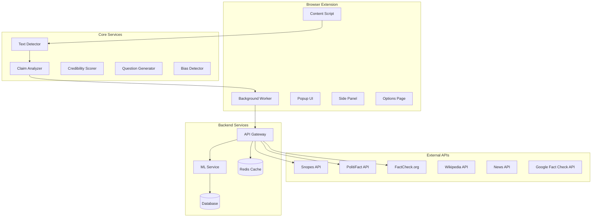
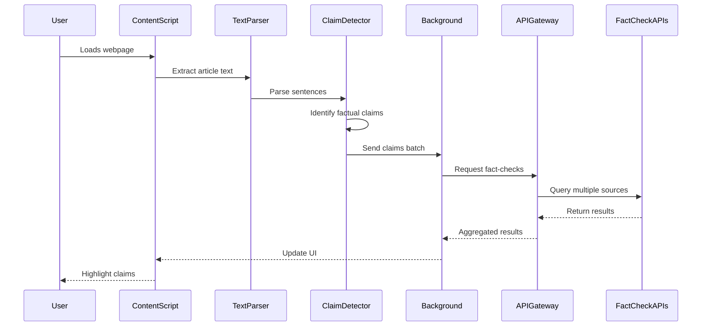
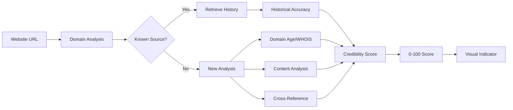

# 📋 Fact-Check Companion - System Design Document

## 🎯 Executive Summary

**Fact-Check Companion** là một browser extension giúp người dùng phát triển tư duy phản biện khi đọc nội dung online. Extension sẽ phân tích real-time các bài viết, highlight các claim cần verify, đánh giá độ tin cậy của nguồn, và gợi ý các câu hỏi phản biện.

### Key Features
- 🔍 **Real-time Claim Detection**: Tự động phát hiện và highlight các claim có thể fact-check
- 📊 **Source Credibility Score**: Đánh giá độ tin cậy của website/tác giả
- 💭 **Critical Questions**: Gợi ý câu hỏi phản biện contextual
- 🔗 **Fact-Check Integration**: Kết nối với APIs của Snopes, PolitiFact, FactCheck.org
- 📈 **Bias Detection**: Phân tích và cảnh báo về potential bias
- 📚 **Learning Mode**: Giúp user học cách tư duy phản biện

---

## 🏗️ System Architecture

### High-Level Architecture



### Component Architecture

```
fact-check-companion/
├── src/
│   ├── background/
│   │   ├── index.ts                 # Main background worker
│   │   ├── messages/
│   │   │   ├── analyze.ts          # Text analysis handler
│   │   │   ├── factcheck.ts       # Fact-check API handler
│   │   │   └── credibility.ts     # Source credibility handler
│   │   └── services/
│   │       ├── claim-detector.ts   # Claim detection service
│   │       ├── api-aggregator.ts   # External API aggregator
│   │       └── cache-manager.ts    # Cache management
│   │
│   ├── contents/
│   │   ├── detector.ts             # Main content script
│   │   ├── highlighter.tsx         # Claim highlighter component
│   │   ├── sidebar.tsx             # Fact-check sidebar
│   │   └── tooltip.tsx             # Hover tooltips
│   │
│   ├── core/
│   │   ├── ml/
│   │   │   ├── claim-classifier.ts # ML claim classification
│   │   │   ├── bias-detector.ts    # Bias detection algorithms
│   │   │   └── models/             # Pre-trained models
│   │   ├── analysis/
│   │   │   ├── text-parser.ts      # NLP text parsing
│   │   │   ├── entity-extractor.ts # Named entity recognition
│   │   │   └── sentiment.ts        # Sentiment analysis
│   │   └── scoring/
│   │       ├── credibility.ts      # Credibility algorithms
│   │       ├── reliability.ts      # Source reliability
│   │       └── metrics.ts          # Scoring metrics
│   │
│   ├── popup/
│   │   ├── index.tsx               # Popup main
│   │   ├── summary.tsx             # Page analysis summary
│   │   └── quick-actions.tsx       # Quick action buttons
│   │
│   ├── sidepanel/
│   │   ├── index.tsx               # Side panel main
│   │   ├── fact-results.tsx       # Fact-check results
│   │   ├── questions.tsx           # Critical questions
│   │   └── sources.tsx             # Alternative sources
│   │
│   ├── options/
│   │   ├── index.tsx               # Options page
│   │   ├── settings/
│   │   │   ├── general.tsx         # General settings
│   │   │   ├── sources.tsx         # Fact-check sources
│   │   │   └── privacy.tsx         # Privacy settings
│   │   └── stats/
│   │       └── dashboard.tsx       # Usage statistics
│   │
│   └── api/
│       ├── fact-checkers/
│       │   ├── snopes.ts           # Snopes integration
│       │   ├── politifact.ts       # PolitiFact integration
│       │   ├── factcheck.ts        # FactCheck.org integration
│       │   └── google.ts           # Google Fact Check API
│       ├── sources/
│       │   ├── wikipedia.ts        # Wikipedia verification
│       │   ├── news-api.ts         # News cross-reference
│       │   └── media-bias.ts       # Media bias checker
│       └── aggregator.ts           # API response aggregator
```

---

## 🔄 Data Flow & Processing

### 1. Content Analysis Flow



### 2. Credibility Scoring Flow



---

## 🎨 User Interface Design

### 1. Content Highlighting System

```typescript
// Claim severity levels and colors
enum ClaimSeverity {
  VERIFIED = 'green',      // ✓ Fact-checked and true
  DISPUTED = 'orange',     // ⚠ Conflicting information
  FALSE = 'red',          // ✗ Fact-checked and false
  UNVERIFIED = 'blue',    // ? Not yet verified
  OPINION = 'purple'      // 💭 Opinion, not factual claim
}

// Highlight styling
interface HighlightStyle {
  backgroundColor: string;
  borderBottom: string;
  cursor: 'help';
  position: 'relative';
}
```

### 2. UI Components

#### A. Inline Highlights
```
[Factual claim text] → Highlighted with underline
    ↓ (on hover)
┌─────────────────────────────┐
│ 📊 Claim Analysis           │
│ Status: ⚠ Disputed          │
│ Confidence: 67%             │
│ Sources: 3 checked          │
│ [View Details]              │
└─────────────────────────────┘
```

#### B. Side Panel Interface
```
┌────────────────────────────────┐
│ 🔍 Fact-Check Results          │
├────────────────────────────────┤
│ Page Credibility: 72/100    🟡 │
│ Claims Found: 12               │
│ Verified: 7 | Disputed: 3      │
├────────────────────────────────┤
│ 📋 Claims:                     │
│                                │
│ 1. "GDP grew by 3.2%..." ✓    │
│    ├─ PolitiFact: True         │
│    └─ Context: Q2 2023 data    │
│                                │
│ 2. "Crime rates fell..." ⚠     │
│    ├─ Snopes: Mostly True      │
│    └─ Note: Regional variance  │
├────────────────────────────────┤
│ 💭 Critical Questions:         │
│ • What's the data source?      │
│ • Any conflicting reports?     │
│ • Who funded this study?       │
└────────────────────────────────┘
```

#### C. Popup Summary
```
┌─────────────────────────┐
│ Fact-Check Companion    │
├─────────────────────────┤
│ 📊 Current Page         │
│ Trust Score: 68%    🟡  │
│ Claims: 8 detected      │
│                         │
│ [🔍 Deep Analysis]      │
│ [📚 View Sources]       │
│ [⚙️ Settings]           │
└─────────────────────────┘
```

---

## 💻 Technical Implementation

### 1. Core Technologies

- **Frontend**: React 18 + TypeScript
- **Styling**: Tailwind CSS
- **State Management**: Zustand + React Query
- **ML/NLP**: TensorFlow.js + compromise.js
- **Backend**: Supabase + Edge Functions
- **Caching**: Redis
- **Analytics**: PostHog

### 2. Key Algorithms

#### A. Claim Detection Algorithm
```typescript
interface ClaimDetector {
  // Step 1: Sentence segmentation
  segmentText(text: string): Sentence[];

  // Step 2: Feature extraction
  extractFeatures(sentence: Sentence): Features;

  // Step 3: Classification
  classifyClaim(features: Features): {
    isClaim: boolean;
    confidence: number;
    type: 'statistical' | 'factual' | 'causal' | 'comparative';
  };

  // Step 4: Entity extraction
  extractEntities(claim: string): {
    subjects: string[];
    predicates: string[];
    objects: string[];
    numbers: string[];
    dates: string[];
  };
}
```

#### B. Credibility Scoring Algorithm
```typescript
interface CredibilityScorer {
  calculateScore(source: Source): number {
    const factors = {
      domainAge: this.checkDomainAge(source.url),        // 0-20
      httpsEnabled: source.url.startsWith('https'),      // 0-10
      authorCredentials: this.checkAuthor(source.author), // 0-20
      citationQuality: this.analyzeCitations(source),     // 0-20
      factCheckHistory: this.getHistoricalAccuracy(),     // 0-30
    };

    return Object.values(factors).reduce((a, b) => a + b, 0);
  }
}
```

#### C. Question Generation Engine
```typescript
interface QuestionGenerator {
  generateQuestions(claim: Claim, context: Context): Question[] {
    const templates = {
      source: "What is the original source of this information?",
      methodology: "How was this data collected?",
      bias: "What potential biases might affect this claim?",
      alternative: "Are there alternative explanations?",
      evidence: "What evidence supports this claim?",
      timeframe: "When was this information published?",
      funding: "Who funded this research/article?",
      sample: "What was the sample size/scope?",
      correlation: "Is this correlation or causation?",
      context: "What context might be missing?"
    };

    return this.selectRelevantQuestions(claim, templates);
  }
}
```

### 3. External API Integration

#### A. Unified Fact-Check Interface
```typescript
interface FactCheckAPI {
  search(claim: string): Promise<FactCheckResult>;
}

class FactCheckAggregator {
  private apis: Map<string, FactCheckAPI> = new Map([
    ['snopes', new SnopesAPI()],
    ['politifact', new PolitiFactAPI()],
    ['factcheck', new FactCheckOrgAPI()],
    ['google', new GoogleFactCheckAPI()]
  ]);

  async checkClaim(claim: string): Promise<AggregatedResult> {
    const results = await Promise.allSettled(
      Array.from(this.apis.values()).map(api =>
        api.search(claim)
      )
    );

    return this.aggregateResults(results);
  }
}
```

### 4. Performance Optimization

#### A. Caching Strategy
```typescript
class CacheManager {
  private cache = new Map<string, CachedResult>();
  private readonly TTL = 24 * 60 * 60 * 1000; // 24 hours

  async get(key: string): Promise<CachedResult | null> {
    const cached = this.cache.get(key);
    if (cached && Date.now() - cached.timestamp < this.TTL) {
      return cached;
    }
    return null;
  }

  set(key: string, result: any): void {
    this.cache.set(key, {
      data: result,
      timestamp: Date.now()
    });
  }
}
```

#### B. Batch Processing
```typescript
class BatchProcessor {
  private queue: Claim[] = [];
  private processing = false;

  async addClaim(claim: Claim): Promise<void> {
    this.queue.push(claim);
    if (!this.processing) {
      this.processBatch();
    }
  }

  private async processBatch(): Promise<void> {
    this.processing = true;

    while (this.queue.length > 0) {
      const batch = this.queue.splice(0, 10); // Process 10 at a time
      await this.processClaimBatch(batch);
      await this.delay(100); // Rate limiting
    }

    this.processing = false;
  }
}
```

---

## 🔐 Privacy & Security

### 1. Data Protection

- **Local Processing First**: Phân tích text locally trước khi gửi API
- **Anonymization**: Remove PII trước khi gửi external APIs
- **Opt-in Analytics**: User có full control về data sharing
- **Secure Storage**: Encrypt sensitive data với user key

### 2. Permissions Required

```json
{
  "permissions": [
    "activeTab",      // Đọc nội dung trang hiện tại
    "storage",        // Lưu settings và cache
    "contextMenus"    // Right-click actions
  ],
  "optional_permissions": [
    "history",        // Analyze browsing patterns
    "bookmarks"       // Save fact-checked articles
  ],
  "host_permissions": [
    "https://*/*",    // Analyze any HTTPS site
    "http://*/*"      // Analyze HTTP sites (với warning)
  ]
}
```

---

## 📊 Analytics & Metrics

### 1. User Engagement Metrics
- Claims highlighted per session
- Fact-check interactions
- Critical questions viewed
- Time spent reviewing results

### 2. Accuracy Metrics
- Fact-check API agreement rate
- User feedback on results
- False positive/negative rates

### 3. Performance Metrics
- Page analysis time
- API response times
- Cache hit rates
- Extension impact on page load

---

## 🚀 Implementation Roadmap

### Phase 1: MVP (Month 1-2)
- [x] Basic claim detection
- [x] Integration với 1 fact-check API
- [x] Simple highlighting UI
- [x] Basic credibility scoring

### Phase 2: Enhanced Features (Month 3-4)
- [ ] Multiple API integration
- [ ] Advanced NLP analysis
- [ ] Bias detection
- [ ] Question generation

### Phase 3: AI Integration (Month 5-6)
- [ ] Custom ML models
- [ ] Real-time learning
- [ ] Personalized recommendations
- [ ] Advanced visualizations

### Phase 4: Scale & Optimize (Month 7+)
- [ ] Performance optimization
- [ ] Multi-language support
- [ ] Mobile browser support
- [ ] API partnerships

---

## 🧪 Testing Strategy

### 1. Unit Tests
- Claim detection accuracy
- API integration reliability
- Scoring algorithm validation

### 2. Integration Tests
- End-to-end fact-checking flow
- Cross-browser compatibility
- Performance benchmarks

### 3. User Testing
- A/B testing different UI approaches
- Usability studies
- Feedback loops

---

## 📈 Success Metrics

1. **Adoption**: 10,000+ active users in 6 months
2. **Engagement**: 70% weekly active rate
3. **Accuracy**: 85%+ fact-check accuracy
4. **Performance**: <2s analysis time per page
5. **User Satisfaction**: 4.5+ star rating

---

## 🔄 Future Enhancements

1. **AI Writing Assistant**: Suggest fact-based corrections
2. **Social Media Integration**: Fact-check posts/tweets
3. **Collaborative Fact-Checking**: Community contributions
4. **Educational Mode**: Teach critical thinking skills
5. **API Marketplace**: Third-party integrations

---

## 📚 Technical Documentation Links

- [API Documentation](#)
- [ML Model Specifications](#)
- [UI Component Library](#)
- [Security Whitepaper](#)
- [Performance Benchmarks](#)
